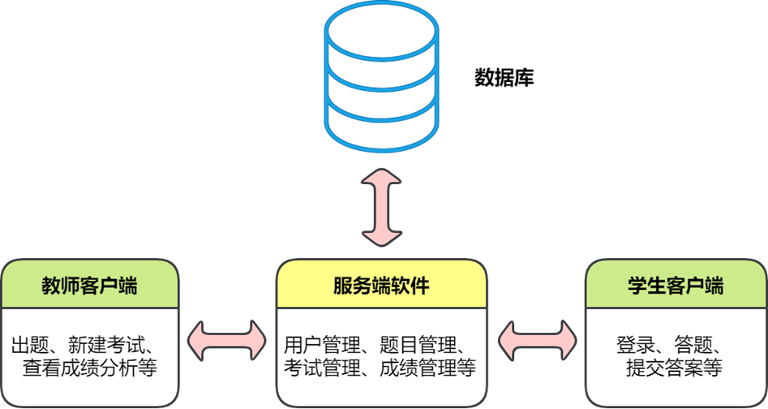

# Welcome!

Easy Testing 是一个在线考试系统。这里是它的文档，
总共包括三大部分：教师用户手册、学生用户手册与设计文档。
教师与学生用户手册分别介绍教师客户端（加上服务端）与学生客户端的使用方法，
解答各自会遇到的一些常见问题。
设计文档解释整个系统的设计思路、软件的模块结构、数据库的模型等。
建议教师用户阅读教师用户手册，选读学生用户手册；
建议学生用户阅读学生用户手册；建议软件开发人员首先阅读用户手册以了解系统功能，
再阅读设计文档以熟悉底层实现。

系统使用 [Apache-2.0](https://www.apache.org/licenses/LICENSE-2.0) 开源许可证；本文档使用 [CC BY 4.0](https://creativecommons.org/licenses/by/4.0/) 许可证。

## 概述

EasyTesting 是一个自动化的在线考试平台，主要针对 Python 课程测验，但在简单的修改后亦可为其他课程的考试服务。其允许教师出题，发布考试，考试结束后查看学生成绩统计信息等；允许学生在考试发布后登录作答，限时提交答案。系统主要由三部分组成：
考生客户端、教师客户端、服务端软件。两个客户端软件分别为两种角色服务，各自通过网络连接服务端软件，而服务端软件主要操作数据库，为客户端的功能提供支持。

