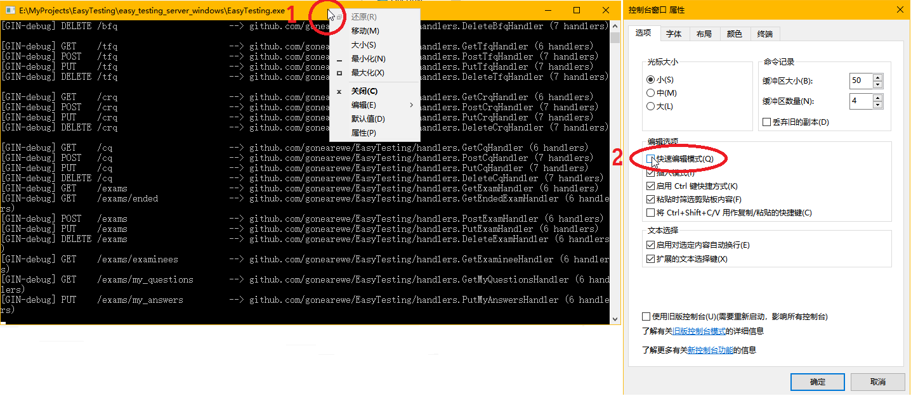

## 部署

首先要安装 MySQL 数据库，建议版本 5.7。
安装步骤参考[官网文档](https://dev.mysql.com/doc/mysql-installation-excerpt/5.7/en/)。

然后将压缩包解压至任意位置，其中包括：

```
├── EasyTesting          服务端主程序
├── server-config.yaml   服务端主程序的配置文件
├── favicon.ico          软件图标
├── index.html           教师端主页面
├── sql                  MySQL 脚本
│   ├── setup.sql        创建数据库的脚本
│   └── test.sql         插入测试数据的脚本
└── static               教师端主页面的静态文件
    ├── css              样式文件
    │   ├── app.4c2aef82.css
    │   ├── chunk-019156c7.a8088982.css
    │   ├── chunk-07c1fcd4.04dea0eb.css
    │   └── ...
    ├── fonts            字体文件
    │   ├── element-icons.535877f5.woff
    │   └── element-icons.732389de.ttf
    ├── img              图片
    │   ├── 404.a57b6f31.png
    │   ├── 404_cloud.0f4bc32b.png
    │   ├── avatar.ecba1844.gif
    │   └── ...
    └── js  javascript  脚本文件
        ├── app.82de0e6e.js
        ├── app.9d60ec40.js
        ├── chunk-019156c7.b0ca593f.js
        └── ...
```

其中 static 文件夹是前端自动打包的，内部文件名与文件数未必与上面的一致。
server-config.yaml 是关键的配置文件，内部的属性都有注释，
如果仅用于测试，仅需修改数据库 dsn 的用户名与密码（即替换掉 `root:12345`）。
记得设置好文件权限：

```
$ sudo chmod -R 644 your_path_to_folder/easy_testing
$ sudo chmod 755 your_path_to_folder/easy_testing/EasyTesting
```

接下来执行数据库脚本 setup.sql，参考[官网文档](https://dev.mysql.com/doc/refman/5.7/en/mysql-batch-commands.html)进行。
如果需要测试数据，还可接着执行 test.sql。

最后**进入文件夹根目录**启动服务端主程序（因为**程序会在当前工作目录下查找配置文件**），

```
$ cd your_path_to_folder/easy_testing
$ ./EasyTesting
```

正常启动后终端会出现日志，类似于：

```
[GIN-debug] [WARNING] Running in "debug" mode. Switch to "release" mode in production.
 - using env:   export GIN_MODE=release
 - using code:  gin.SetMode(gin.ReleaseMode)

[GIN-debug] GET    /teacher_auth             --> github.com/appleboy/gin-jwt/v2.(*GinJWTMiddleware).LoginHandler-fm (5 handlers)
[GIN-debug] GET    /student_auth             --> github.com/appleboy/gin-jwt/v2.(*GinJWTMiddleware).LoginHandler-fm (5 handlers)
[GIN-debug] GET    /                         --> github.com/gin-gonic/gin.(*RouterGroup).StaticFile.func1 (5 handlers)
[GIN-debug] HEAD   /                         --> github.com/gin-gonic/gin.(*RouterGroup).StaticFile.func1 (5 handlers)
[GIN-debug] GET    /favicon.ico              --> github.com/gin-gonic/gin.(*RouterGroup).StaticFile.func1 (5 handlers)
[GIN-debug] HEAD   /favicon.ico              --> github.com/gin-gonic/gin.(*RouterGroup).StaticFile.func1 (5 handlers)
[GIN-debug] GET    /static/*filepath         --> github.com/gin-gonic/gin.(*RouterGroup).createStaticHandler.func1 (5 handlers)
[GIN-debug] HEAD   /static/*filepath         --> github.com/gin-gonic/gin.(*RouterGroup).createStaticHandler.func1 (5 handlers)
[GIN-debug] GET    /ping                     --> github.com/gonearewe/EasyTesting/handlers.PingHandler (5 handlers)
[GIN-debug] GET    /hello                    --> github.com/gonearewe/EasyTesting/handlers.HelloHandler (6 handlers)
[GIN-debug] GET    /cache                    --> github.com/gonearewe/EasyTesting/handlers.GetCacheHandler (6 handlers)
[GIN-debug] PUT    /cache                    --> github.com/gonearewe/EasyTesting/handlers.PutCacheHandler (6 handlers)
```

为了调试方便，可以把 stdout 和 stderr 都重定向到文件中并让程序后台运行：

```
$ ./EasyTesting &> debug.log &
```

> #### warning::Windows 平台注意终端冻结问题
>
> 假如你在 Windows 10 平台下运行服务端，则要尤其注意：终端默认会在你点击它，同时应用程序有输出时，直接冻结程序。
> 通常只需要按下 Esc 或回车就能恢复程序，但倘若没有注意到这个问题，也许会导致大量的客户端连接超时
> （报错：timeout of 5000ms exceeded）。
>
> 这并非是软件自身的 bug，而是 Windows 10 的问题。
> 详情参见 [Why is my command prompt freezing on Windows 10?](https://stackoverflow.com/questions/33883530/why-is-my-command-prompt-freezing-on-windows-10)。
> 解决方法是在终端标题栏上右键，菜单选择*默认值*或*属性*（*默认值*会应用于所有终端），取消勾选*快速编辑模式*，
> *确定*并重启终端。



现在即可在浏览器上访问 <http://localhost:9000> 进入教师端（如果你没有修改默认端口号的话）。
test.sql 提供的教师用户有：

|    工号    | 姓名  |  密码 |
| :--------: | :---: | ----: |
|     0      | root  | ET000 |
| 2010301800 | 张三  | Scala |
| 2012550921 | 李四  |  K_On |


<!-- 如果服务器出现

> Error 1292: Incorrect datetime value: '0000-00-00' for column 'end_time'

说明是 MySQL 禁用了 datetime 类型的零值。
可以通过在 MySQL console 中输入 `SELECT @@GLOBAL.sql_mode;` 查看
全局的 sql_mode，它可能包括这些内容：

```
ONLY_FULL_GROUP_BY,STRICT_TRANS_TABLES,NO_ZERO_IN_DATE,NO_ZERO_DATE,ERROR_FOR_DIVISION_BY_ZERO,NO_AUTO_CREATE_USER,NO_ENGINE_SUBSTITUTION
```

我们只需要删除其中的 NO_ZERO_IN_DATE 与 NO_ZERO_DATE，通过重新全局设置 sql_mode：

> SET GLOBAL sql_mode = 'ONLY_FULL_GROUP_BY,STRICT_TRANS_TABLES,ERROR_FOR_DIVISION_BY_ZERO,NO_ENGINE_SUBSTITUTION';

参考 Stackoverflow 上的问题 [MySQL Incorrect datetime value: '0000-00-00 00:00:00'](https://stackoverflow.com/questions/35565128/mysql-incorrect-datetime-value-0000-00-00-000000) -->