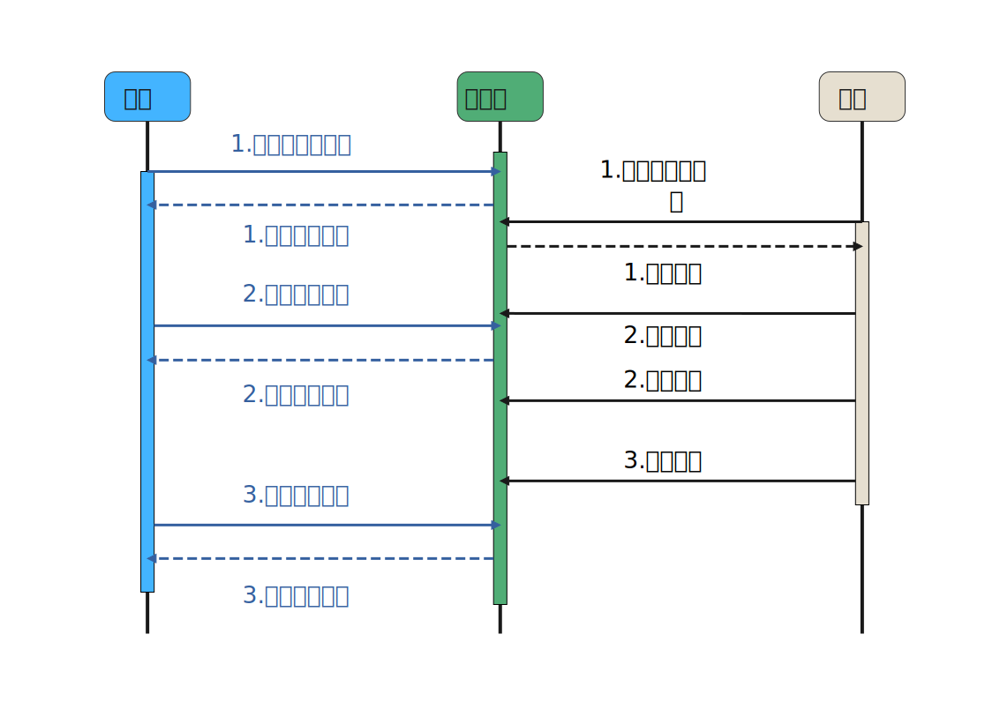

在介绍完后台数据库与前后端接口后，服务端软件的处理逻辑已经跃然纸上了。
服务端需要响应教师端的 GET、POST、PUT、DELETE 请求，操作对应的数据库表；
当有考试进行时，它还要响应学生端，处理更为复杂的随机发题、保存作答、判分统计等请求。

## 源代码的文件结构

不过，在讨论这些流程逻辑之前，我们先来详细看看服务端源代码的文件结构。

```
.
├── init.go             初始化逻辑
├── main.go             程序入口
├── router.go           HTTP 路由
├── server-config.yaml  程序的配置文件
├── go.mod              项目依赖文件
├── go.sum              自动生成的项目依赖文件
├── config.yml          gormt 的配置文件
├── middlewares         中间件模块
│   ├── middlewares.go    模块入口
│   ├── auth.go           认证与授权中间件
│   ├── check_exam.go     考试检查中间件
│   ├── cors.go           CORS 中间件
│   ├── log.go            日志中间件
│   ├── ratelimit.go      限流中间件
│   └── recovery.go       异常恢复中间件
├── dao                 数据访问模块
│   ├── bfq.go
│   ├── common.go
│   ├── cq.go
│   ├── crq.go
│   ├── dao.go
│   ├── exam.go
│   ├── exam_session.go
│   ├── maq.go
│   ├── mcq.go
│   ├── student.go
│   ├── teacher.go
│   └── tfq.go
├── handlers            Handlers 模块
│   ├── bfq.go
│   ├── cache.go
│   ├── cq.go
│   ├── crq.go
│   ├── exam.go
│   ├── exam_session.go
│   ├── hello.go
│   ├── maq.go
│   ├── mcq.go
│   ├── ping.go
│   ├── student.go
│   ├── teacher.go
│   └── tfq.go
├── models              数据模型模块
│   ├── my_answers.go
│   ├── bfq.go
│   ├── bfq_answer.go
│   ├── cq.go
│   ├── cq_answer.go
│   ├── crq.go
│   ├── crq_answer.go
│   ├── exam.go
│   ├── exam_session.go
│   ├── exam_session_task.go
│   ├── maq.go
│   ├── maq_answer.go
│   ├── mcq.go
│   ├── mcq_answer.go
│   ├── student.go
│   ├── teacher.go
│   ├── tfq.go
│   └── tfq_answer.go
├── sql                 数据库脚本
│   ├── setup.sql         创建脚本
│   └── test.sql          插入测试数据的脚本
└── utils               辅助工具模块
    ├── cache.go
    ├── password.go
    └── utils.go
```

main.go 中的 main 函数是程序的入口，它会初始化 Gin 的 Engine 并设置中间件与路由，
最后进入 http.ListenAndServe 的无限循环。而在这之前，程序会依次初始化 Viper（读取配置参数），日志与 Gorm。
中间件位于 middlewares 文件夹中，主要包括*日志*、*异常恢复*、*跨域*、*限流*、*鉴权*与*考试状态检查*。路由则全在 router.go 中。

*日志*采用 [github.com/rs/zerolog](https://github.com/rs/zerolog)，
它是一个高性能、低开销并且 API 简单易用的日志库；*日志*中间件主要打印 Gin 写请求的 request 与 response 的 body，方便调试；所有的日志（包括 Gorm 的）都会在终端上和程序目录下的日志文件（server-config.yaml 中配置的默认文件名为 debug.log）中同时输出，其中，日志文件的内容会在程序重启时自动清空以避免无节制地浪费空间，所以如果调试需要，应及时备份。
*鉴权*方案采用 [github.com/appleboy/gin-jwt/v2](https://github.com/appleboy/gin-jwt)，
它会对接口进行权限控制，*鉴权*工作流程具体参考 [API 文档](./api.md)。
*限流*中间件采用 [github.com/ulule/limiter/v3](https://github.com/ulule/limiter)，
用于控制 RPS(Request Per Second) 以避免程序被大量请求击垮，RPS 限制值可在文件 server-config.yaml 中配置。
*考试状态检查*中间件实现了 [API 文档](./api.md)中的教师客户端 API 的生命周期控制，
阻止教师在有考试进行或有考试未计算分数时对某些接口的访问，以确保数据一致性。
而学生客户端 API 的生命周期控制则在*鉴权*中间件中实现，
`studentAuthenticator` 控制 `GET student_auth` 的生命周期，
`studentAuthorizator` 控制其他 API 的生命周期。

handlers 模块中的函数大多是 gin.handlerFunc，被直接注册在路由中。
它们主要提取请求参数，验证参数，并调用 dao(Data Access Object) 模块的函数操作数据库完成请求。
dao 模块直接使用 Gorm 框架完成数据库的 CRUD 操作，并在需要的时候启用事务。
models 模块包含对应于数据库表的一堆结构体（Structure），
它们是 [gormt](https://github.com/xxjwxc/gormt) 根据先建好的数据库自动生成的，
不过我们在生成的结构体的基础上做了一些修改（如删除 password 字段的 json tag 以防止其被序列化给客户端）。

## 考试流程逻辑

现在，我们介绍一下考试流程逻辑。



考试的前提是录入了考生的名单并且题库中已有充足的试题，这分别通过 `POST students` 与 `POST <question>` 完成。
然后一场考试将通过 `POST exam` 新建，这个 *exam* 包括 *start_time* 与 *end_time* 属性，
在这两个时刻间考生可通过 `GET student_auth` 获得授权并进入考试。
服务端会先插入一条 *exam_session* 记录，再按 *exam* 的各题型题数配置随机读取各张试题表中的记录组成试卷，
然后将初始作答情况（自然是空的）插入对应的 *answer* 系列的表，整个事务成功后该考生即进入了考试。

接下来考生将访问 `GET exams/my_questions`，服务端根据他在 *answer* 系列的表中记录即可反向查询到对应的试题信息（题干等），
简单组织后即可交给考生。接着，客户端在考试过程中将周期性地访问 `PUT exams/my_answers` 与 `PUT cache` 以保存作答情况；
对于 `PUT exams/my_answers`，服务端将新的作答情况覆盖到他的 *answer* 系列的表中，
而对于后者，服务端将 request body 缓存到内存中。
客户端倘若中途退出重进，因为它本身不保存任何信息，要想恢复到退出前的状态必须依靠服务端保存的信息。
客户端需要通过 `GET student_auth` 重新获得授权（但不会重新执行进入考试的逻辑），
再访问 `GET exams/my_questions` 读取自己的试卷，最后通过 `GET cache` 恢复作答情况至上次保存时。
之所以设计了 `cache` 接口而不是设计一个 `GET exams/my_answers` 接口，
是因为从数据库读回作答情况的逻辑相对更复杂。
在考试期间，教师仍可查询各项信息（包括正在参加考试的学生名单），但不可进行任何修改、删除操作。

最后，考试结束后，考生的 `GET student_auth` 接口会被 `studentAuthenticator` 拦截，
而其他所有接口都会被 `studentAuthorizator` 拦截。
但是此时教师的接口访问依然受限，这是因为这场考试还没有完成分数的计算。
为了避免冗余的计算，服务端没有在 `PUT exams/my_answers` 时同时计算该考生的分数，
而是把所有考生的分数计算放在该考试结束后。
在 xxx 号考试结束后，教师*查看考试结果*时第一次访问 `GET exams/examinees?exam_id=xxx` 会触发 xxx 号考试的*分数计算*逻辑。
服务端提取每一位考生的作答情况，将其与正确答案比对，计算并记录其最终得分。
在*分数计算*的同时，也会更新各题目的总答对分数与总分数，方便统计题目难度。
每一位考生的总分都计算完成后，服务端会标记该考试在数据库中的 *scores_calculated* 字段以避免*分数计算*逻辑被重复触发。


