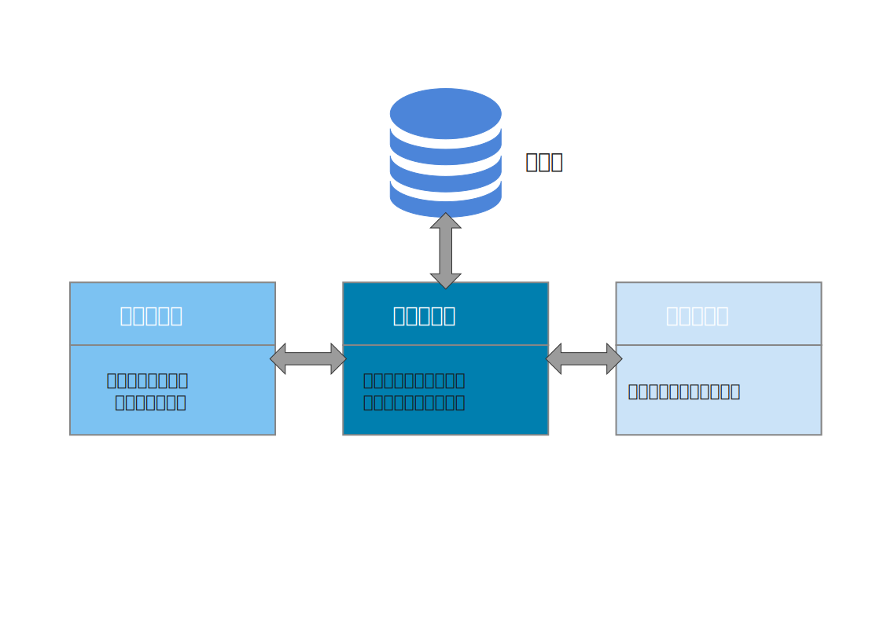
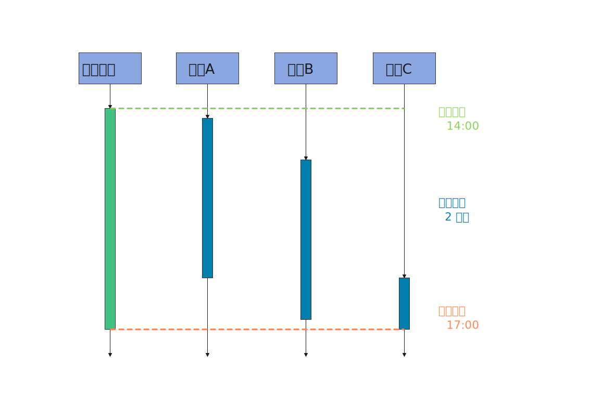
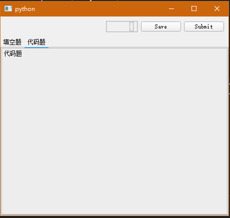
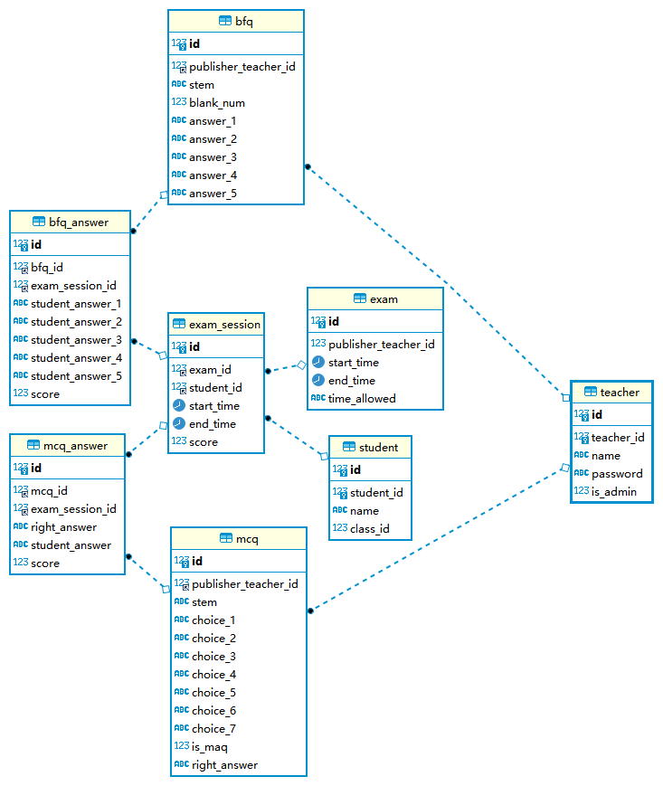
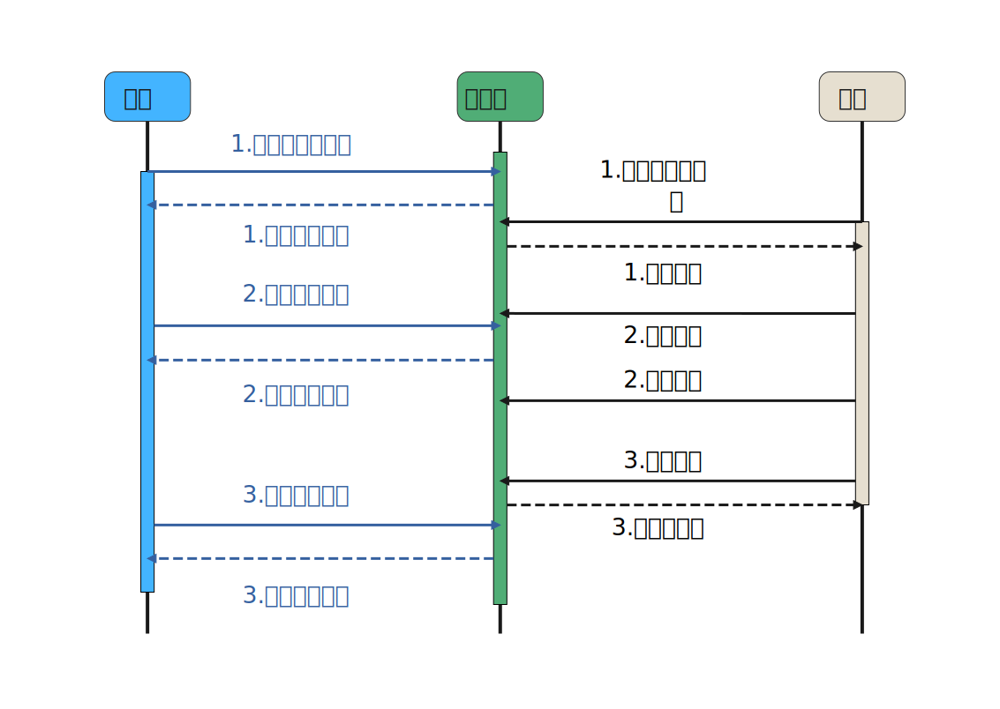

# 软件设计说明书

## 概述

EasyTesting 是一个自动化的在线考试平台，主要针对 Python 课程测试。 其允许教师出题，发布考试，考试结束后查看学生成绩统计信息； 允许学生在考试发布后登录作答，限时提交答案。系统主要由三部分组成：
考生客户端、教师客户端、服务端软件。两个客户端软件分别为两种角色服务， 各自通过网络连接服务端软件，而服务端软件主要提供数据库相关功能（角色管理、题目管理、成绩管理等）。



## 技术选型

- 数据库：MySQL
- 服务端软件：Go、[Gin](https://gin-gonic.com/)
- 学生客户端：Python、PyQt5、[qtmodern](https://github.com/gmarull/qtmodern)
- 教师客户端：Python、PyQt5、[qtmodern](https://github.com/gmarull/qtmodern)

## 教师客户端设计

教师客户端为教师服务。教师角色中又有一种特殊的超级管理员角色，他除了具有基本的教师权限外， 还可以增删改查教师用户本身。

客户端启动后会进入登录界面，需要输入服务器 IP 及端口号和用户名（工号）及其密码。 如果信息正确，即可进入客户端软件。之后，用户可以在主界面中看到一些功能菜单项：“试题管理”、 “考试管理”、”个人信息“与”用户管理“（超级管理员专有）。

### 试题管理

用户可以在这里操作数据库中的试题。他可以新建试题，在软件支持的 5 种题目类型 （选择题、填空题、判断对错题、读程序题、写程序题）中选择一种进入相应的试题创建向导， 并按提示完成题干。题干编辑是在一个内嵌的富文本编辑器中进行的，支持
Markdown 格式。 试题完成后会被提交到数据库成为题库的一部分，学生参加考试时得到的试题就是从中随机抽取的。 他也可以查看已有的试题，并对其进行修改或删除。

### 考试管理

教师在“考试管理”中创建一个新的考试是学生能参加考试的前提。 教师用户需要根据提示选择考试开始时刻、结束时刻、答题时间、试卷题量等。

> 答题时间不等于结束时刻减开始时刻，而是应当小于它。
>
> 因为学生参加考试的时间是弹性的，他可以选择在开始时刻与结束时刻间的任意时刻登录。
> 每个学生的答题时间都是从各自的登录作答时刻开始计算的。但是结束时刻之后服务器将不再接受答卷的提交。
> 教师应当引导学生在考试开始后尽快登录作答。



考试发布后系统会生成一个考试 ID，用户应将其告知考生，使用不同的 ID 将进入同时进行的不同考试， 使用无效的 ID 将无法进入考试。 用户还能查看处于不同状态（还未开始、正在进行、已经结束）的所有考试，
删除还未开始与已经结束的考试，修改还未开始的考试信息。对于已经结束的考试， 用户可以查看某次考试中所有人的成绩以及对应的统计信息（平均分、不及格率等）， 数据以可视化方式给出，且支持以 Excel 等格式导出。

### 个人信息

用户可以查看和修改自己的密码、称呼等，但不能修改用户名，也不能删除自己的账户。

### 用户管理

这是超级管理员专有的权限，他可以在这里增加新的超级管理员与新的教师用户，重置其他普通教师的密码。 可以增加与删除考生，通过 Excel 等格式批量导入、导出所有考生信息（学号、姓名、班级等）。 只有预先记录进系统的考生才能参加后续的考试。

## 学生客户端设计

学生用户是参与考试的主体。他需要在学生客户端登录界面输入正确的服务器 IP 及端口号、考试 ID、 用户名（学号），并确认个人信息、阅读注意事项、勾选诚信保证，才能进入考试答题主界面。
主界面包括两个部分：工具栏与试题。通过切换工具栏中的标签页，用户可以进入要作答的不同题型。 同一题型包含多道小题，用户可以自由决定答题顺序。工具栏还会显示已答题数、未答题数、剩余答题时间等。
客户端会每隔一段时间就自动保存当前作答情况至服务器，用户也可通过“保存”按钮手动保存。 而通过“提交”按钮，用户可以保存作答情况并结束本次考试。即使用户不手动提交，
剩余答题时间归零时软件也会自动提交。提交成功后用户即可看到系统自动计算的考试成绩。

系统支持 5 种题目类型：选择题、填空题、判断对错题、读程序题、写程序题。 选择题又分为单项选择与多项选择，普通的填空题每题一个空，读程序题是给出一段代码和多个空的特殊的填空题， 写程序题要求根据题意完成整段代码，支持类似 OJ
的“给定输入，测试输出”功能。



## 服务端与数据库设计

为了支持所需的服务，EasyTesting 系统设计了如下的数据库表结构。

> Working In Progress

```mysql
USE easy_testing;
SET FOREIGN_KEY_CHECKS = 0;

-- ----------------------------
-- Table structure for student
-- ----------------------------
DROP TABLE IF EXISTS `student`;
CREATE TABLE `student`
(
    `id`         int(10)            NOT NULL AUTO_INCREMENT COMMENT '用作主键',
    `student_id` varchar(10) UNIQUE NOT NULL COMMENT '学号',
    `name`       varchar(50)        NOT NULL COMMENT '姓名',
    `class_id`   varchar(10)        NOT NULL COMMENT '班号',
    PRIMARY KEY (`id`),
    INDEX (`student_id`),
    INDEX (`name`)
) ENGINE = InnoDB
  DEFAULT CHARSET = utf8mb4;

-- ----------------------------
-- Table structure for teacher
-- ----------------------------
DROP TABLE IF EXISTS `teacher`;
CREATE TABLE `teacher`
(
    `id`         int(10)            NOT NULL AUTO_INCREMENT COMMENT '用作主键',
    `teacher_id` varchar(10) UNIQUE NOT NULL COMMENT '工号',
    `name`       varchar(50)        NOT NULL COMMENT '姓名',
    `password`   varchar(100)       NOT NULL COMMENT '加盐后的密码',
    `salt`       varchar(50)        NOT NULL COMMENT '盐',
    `is_admin`   bool               NOT NULL DEFAULT FALSE COMMENT '是否为超级管理员',
    PRIMARY KEY (`id`),
    INDEX (`teacher_id`),
    INDEX (`name`)
) ENGINE = InnoDB
  DEFAULT CHARSET = utf8mb4;

-- ----------------------------
-- Table structure for exam
-- ----------------------------
DROP TABLE IF EXISTS `exam`;
CREATE TABLE `exam`
(
    `id`                   int(10)             NOT NULL AUTO_INCREMENT COMMENT '用作主键',
    `publisher_teacher_id` varchar(10)         NOT NULL COMMENT '发布考试的教师的工号',
    `start_time`           datetime            NOT NULL COMMENT '考试开始时刻',
    `end_time`             datetime            NOT NULL COMMENT '考试结束时刻',
    `time_allowed`         tinyint(3)          NOT NULL COMMENT '考生答题时间，单位：分钟',
    `mcq_score`            tinyint(2) unsigned NOT NULL COMMENT '单选题每题分数',
    `mcq_num`              tinyint(2) unsigned NOT NULL COMMENT '单选题题数',
    `maq_score`            tinyint(2) unsigned NOT NULL COMMENT '多选题每题分数',
    `maq_num`              tinyint(2) unsigned NOT NULL COMMENT '多选题题数',
    `bfq_score`            tinyint(2) unsigned NOT NULL COMMENT '填空题每题分数',
    `bfq_num`              tinyint(2) unsigned NOT NULL COMMENT '填空题题数',
    `tfq_score`            tinyint(2) unsigned NOT NULL COMMENT '判断题每题分数',
    `tfq_num`              tinyint(2) unsigned NOT NULL COMMENT '判断题题数',
    `crq_score`            tinyint(2) unsigned NOT NULL COMMENT '代码阅读题每题分数',
    `crq_num`              tinyint(2) unsigned NOT NULL COMMENT '代码阅读题题数',
    `cq_score`             tinyint(2) unsigned NOT NULL COMMENT '写代码题每题分数',
    `cq_num`               tinyint(2) unsigned NOT NULL COMMENT '写代码题题数',
    FOREIGN KEY (`publisher_teacher_id`) REFERENCES teacher (`teacher_id`) ON DELETE CASCADE ON UPDATE CASCADE,
    PRIMARY KEY (`id`)
) ENGINE = InnoDB
  DEFAULT CHARSET = utf8mb4;

-- ----------------------------
-- Table structure for exam session
-- ----------------------------
DROP TABLE IF EXISTS `exam_session`;
CREATE TABLE `exam_session`
(
    `id`           int(10)     NOT NULL AUTO_INCREMENT COMMENT '用作主键',
    `exam_id`      int(10)     NOT NULL COMMENT '连接 exam',
    `student_id`   varchar(10) NOT NULL COMMENT '连接 student',
    `student_name` varchar(50) NOT NULL COMMENT '考生的姓名',
    `start_time`   datetime    NOT NULL COMMENT '作答开始时刻',
    `end_time`     datetime   DEFAULT NULL COMMENT '交卷时刻',
    `answer_sheet` mediumblob DEFAULT NULL COMMENT '包括考试试题与作答情况的pdf，用于存档',
    `score`        smallint   DEFAULT NULL COMMENT '最终成绩*10，即保存到小数点后一位',
    FOREIGN KEY (`exam_id`) REFERENCES exam (`id`) ON DELETE CASCADE ON UPDATE CASCADE,
    FOREIGN KEY (`student_id`) REFERENCES student (`student_id`) ON DELETE CASCADE ON UPDATE CASCADE,
    PRIMARY KEY (`id`)
) ENGINE = InnoDB
  DEFAULT CHARSET = utf8mb4;

-- ----------------------------
-- Table structure for multiple choice question (mcq)
-- ----------------------------
DROP TABLE IF EXISTS `mcq`;
CREATE TABLE `mcq`
(
    `id`                   int(10)     NOT NULL AUTO_INCREMENT COMMENT '用作主键',
    `publisher_teacher_id` varchar(10) NOT NULL COMMENT '创建本题的教师的工号',
    `stem`                 text(200)   NOT NULL COMMENT '题干',
    `choice_1`             text(200)   NOT NULL COMMENT '选项的内容',
    `choice_2`             text(200)   NOT NULL COMMENT '选项的内容',
    `choice_3`             text(200)   NOT NULL COMMENT '选项的内容',
    `choice_4`             text(200)   NOT NULL COMMENT '选项的内容',
    `right_answer`         char(1)     NOT NULL COMMENT '答案，正确选项的索引，如 "4"、"1"',
    FOREIGN KEY (`publisher_teacher_id`) REFERENCES teacher (`teacher_id`) ON DELETE CASCADE ON UPDATE CASCADE,
    PRIMARY KEY (`id`)
) ENGINE = InnoDB
  DEFAULT CHARSET = utf8mb4;

-- ----------------------------
-- Table structure for students' answer of multiple choice question (mcq)
-- ----------------------------
DROP TABLE IF EXISTS `mcq_answer`;
CREATE TABLE `mcq_answer`
(
    `id`              int(10) NOT NULL AUTO_INCREMENT COMMENT '用作主键',
    `mcq_id`          int(10) NOT NULL COMMENT '连接 mcq',
    `exam_session_id` int(10) NOT NULL COMMENT '连接 exam_session',
    `right_answer`    char(1) NOT NULL COMMENT '正确答案，与 mcq 中同名字段保持一致',
    `student_answer`  char(1) DEFAULT NULL COMMENT '学生的答案',
    FOREIGN KEY (`mcq_id`) REFERENCES mcq (`id`) ON DELETE CASCADE ON UPDATE CASCADE,
    FOREIGN KEY (`exam_session_id`) REFERENCES exam_session (`id`) ON DELETE CASCADE ON UPDATE CASCADE,
    PRIMARY KEY (`id`)
) ENGINE = InnoDB
  DEFAULT CHARSET = utf8mb4;

-- ----------------------------
-- Table structure for multiple answer question (maq)
-- ----------------------------
DROP TABLE IF EXISTS `maq`;
CREATE TABLE `maq`
(
    `id`                   int(10)     NOT NULL AUTO_INCREMENT COMMENT '用作主键',
    `publisher_teacher_id` varchar(10) NOT NULL COMMENT '创建本题的教师的工号',
    `stem`                 text(200)   NOT NULL COMMENT '题干',
    `choice_1`             text(200)   NOT NULL COMMENT '选项的内容',
    `choice_2`             text(200)   NOT NULL COMMENT '选项的内容',
    `choice_3`             text(200)   NOT NULL COMMENT '选项的内容',
    `choice_4`             text(200)   NOT NULL COMMENT '选项的内容',
    `choice_5`             text(200) DEFAULT NULL COMMENT '选项的内容',
    `choice_6`             text(200) DEFAULT NULL COMMENT '选项的内容',
    `choice_7`             text(200) DEFAULT NULL COMMENT '选项的内容',
    `right_answer`         char(7)     NOT NULL COMMENT '答案，按升序包含所有正确选项的索引，如 "5"、"124"、"67"',
    FOREIGN KEY (`publisher_teacher_id`) REFERENCES teacher (`teacher_id`) ON DELETE CASCADE ON UPDATE CASCADE,
    PRIMARY KEY (`id`)
) ENGINE = InnoDB
  DEFAULT CHARSET = utf8mb4;

-- ----------------------------
-- Table structure for students' answer of multiple answer question (maq)
-- ----------------------------
DROP TABLE IF EXISTS `maq_answer`;
CREATE TABLE `maq_answer`
(
    `id`              int(10) NOT NULL AUTO_INCREMENT COMMENT '用作主键',
    `maq_id`          int(10) NOT NULL COMMENT '连接 maq',
    `exam_session_id` int(10) NOT NULL COMMENT '连接 exam_session',
    `right_answer`    char(7) NOT NULL COMMENT '正确答案，与 maq 中同名字段保持一致',
    `student_answer`  char(7) DEFAULT NULL COMMENT '学生的答案',
    FOREIGN KEY (`maq_id`) REFERENCES maq (`id`) ON DELETE CASCADE ON UPDATE CASCADE,
    FOREIGN KEY (`exam_session_id`) REFERENCES exam_session (`id`) ON DELETE CASCADE ON UPDATE CASCADE,
    PRIMARY KEY (`id`)
) ENGINE = InnoDB
  DEFAULT CHARSET = utf8mb4;

-- ----------------------------
-- Table structure for blank filling question (bfq)
-- ----------------------------
DROP TABLE IF EXISTS `bfq`;
CREATE TABLE `bfq`
(
    `id`                   int(10)     NOT NULL AUTO_INCREMENT COMMENT '用作主键',
    `publisher_teacher_id` varchar(10) NOT NULL COMMENT '创建本题的教师的工号',
    `stem`                 text(200)   NOT NULL COMMENT '题干',
    `blank_num`            tinyint(2)  NOT NULL COMMENT '要填的空的数目',
    `answer_1`             text(50)    NOT NULL COMMENT '填空的答案',
    `answer_2`             text(50) DEFAULT NULL COMMENT '填空的答案',
    `answer_3`             text(50) DEFAULT NULL COMMENT '填空的答案',
    FOREIGN KEY (`publisher_teacher_id`) REFERENCES teacher (`teacher_id`) ON DELETE CASCADE ON UPDATE CASCADE,
    PRIMARY KEY (`id`)
) ENGINE = InnoDB
  DEFAULT CHARSET = utf8mb4;

-- ----------------------------
-- Table structure for students' answer of blank filling question (bfq)
-- ----------------------------
DROP TABLE IF EXISTS `bfq_answer`;
CREATE TABLE `bfq_answer`
(
    `id`               int(10) NOT NULL AUTO_INCREMENT COMMENT '用作主键',
    `bfq_id`           int(10) NOT NULL COMMENT '连接 bfq',
    `exam_session_id`  int(10) NOT NULL COMMENT '连接 exam_session',
    `student_answer_1` text(50) DEFAULT NULL COMMENT '学生的答案',
    `student_answer_2` text(50) DEFAULT NULL COMMENT '学生的答案',
    `student_answer_3` text(50) DEFAULT NULL COMMENT '学生的答案',
    FOREIGN KEY (`bfq_id`) REFERENCES bfq (`id`) ON DELETE CASCADE ON UPDATE CASCADE,
    FOREIGN KEY (`exam_session_id`) REFERENCES exam_session (`id`) ON DELETE CASCADE ON UPDATE CASCADE,
    PRIMARY KEY (`id`)
) ENGINE = InnoDB
  DEFAULT CHARSET = utf8mb4;

-- ----------------------------
-- Table structure for true false question (tfq)
-- ----------------------------
DROP TABLE IF EXISTS `tfq`;
CREATE TABLE `tfq`
(
    `id`                   int(10)     NOT NULL AUTO_INCREMENT COMMENT '用作主键',
    `publisher_teacher_id` varchar(10) NOT NULL COMMENT '创建本题的教师的工号',
    `stem`                 text(200)   NOT NULL COMMENT '题干',
    `answer`               bool        NOT NULL COMMENT '正确答案',
    FOREIGN KEY (`publisher_teacher_id`) REFERENCES teacher (`teacher_id`) ON DELETE CASCADE ON UPDATE CASCADE,
    PRIMARY KEY (`id`)
) ENGINE = InnoDB
  DEFAULT CHARSET = utf8mb4;

-- ----------------------------
-- Table structure for students' answer of true false question (tfq)
-- ----------------------------
DROP TABLE IF EXISTS `tfq_answer`;
CREATE TABLE `tfq_answer`
(
    `id`              int(10) NOT NULL AUTO_INCREMENT COMMENT '用作主键',
    `tfq_id`          int(10) NOT NULL COMMENT '连接 tfq',
    `exam_session_id` int(10) NOT NULL COMMENT '连接 exam_session',
    `right_answer`    bool    NOT NULL COMMENT '正确答案，与 tfq 中同名字段保持一致',
    `student_answer`  bool DEFAULT NULL COMMENT '学生的答案',
    FOREIGN KEY (`tfq_id`) REFERENCES tfq (`id`) ON DELETE CASCADE ON UPDATE CASCADE,
    FOREIGN KEY (`exam_session_id`) REFERENCES exam_session (`id`) ON DELETE CASCADE ON UPDATE CASCADE,
    PRIMARY KEY (`id`)
) ENGINE = InnoDB
  DEFAULT CHARSET = utf8mb4;

-- ----------------------------
-- Table structure for code reading question (crq)
-- ----------------------------
DROP TABLE IF EXISTS `crq`;
CREATE TABLE `crq`
(
    `id`                   int(10)     NOT NULL AUTO_INCREMENT COMMENT '用作主键',
    `publisher_teacher_id` varchar(10) NOT NULL COMMENT '创建本题的教师的工号',
    `stem`                 text(200)   NOT NULL COMMENT '题干',
    `blank_num`            tinyint(2)  NOT NULL COMMENT '要填的空的数目',
    `answer_1`             text(50)    NOT NULL COMMENT '填空的答案',
    `answer_2`             text(50)    NOT NULL COMMENT '填空的答案',
    `answer_3`             text(50) DEFAULT NULL COMMENT '填空的答案',
    `answer_4`             text(50) DEFAULT NULL COMMENT '填空的答案',
    `answer_5`             text(50) DEFAULT NULL COMMENT '填空的答案',
    `answer_6`             text(50) DEFAULT NULL COMMENT '填空的答案',
    FOREIGN KEY (`publisher_teacher_id`) REFERENCES teacher (`teacher_id`) ON DELETE CASCADE ON UPDATE CASCADE,
    PRIMARY KEY (`id`)
) ENGINE = InnoDB
  DEFAULT CHARSET = utf8mb4;

-- ----------------------------
-- Table structure for students' answer of code reading question (crq)
-- ----------------------------
DROP TABLE IF EXISTS `crq_answer`;
CREATE TABLE `crq_answer`
(
    `id`               int(10) NOT NULL AUTO_INCREMENT COMMENT '用作主键',
    `crq_id`           int(10) NOT NULL COMMENT '连接 crq',
    `exam_session_id`  int(10) NOT NULL COMMENT '连接 exam_session',
    `student_answer_1` text(50) DEFAULT NULL COMMENT '学生的答案',
    `student_answer_2` text(50) DEFAULT NULL COMMENT '学生的答案',
    `student_answer_3` text(50) DEFAULT NULL COMMENT '学生的答案',
    `student_answer_4` text(50) DEFAULT NULL COMMENT '学生的答案',
    `student_answer_5` text(50) DEFAULT NULL COMMENT '学生的答案',
    `student_answer_6` text(50) DEFAULT NULL COMMENT '学生的答案',
    FOREIGN KEY (`crq_id`) REFERENCES crq (`id`) ON DELETE CASCADE ON UPDATE CASCADE,
    FOREIGN KEY (`exam_session_id`) REFERENCES exam_session (`id`) ON DELETE CASCADE ON UPDATE CASCADE,
    PRIMARY KEY (`id`)
) ENGINE = InnoDB
  DEFAULT CHARSET = utf8mb4;

-- ----------------------------
-- Table structure for coding question (cq)
-- ----------------------------
DROP TABLE IF EXISTS `cq`;
CREATE TABLE `cq`
(
    `id`                   int(10)     NOT NULL AUTO_INCREMENT COMMENT '用作主键',
    `publisher_teacher_id` varchar(10) NOT NULL COMMENT '创建本题的教师的工号',
    `stem`                 text(200)   NOT NULL COMMENT '题干',
    `is_input_from_file`   bool        NOT NULL COMMENT '程序输入是否从文件读取，若为否，从命令行读取',
    `is_output_to_file`    bool        NOT NULL COMMENT '程序输出是否写入文件，若为否，输出到命令行',
    `input`                text(200)   NOT NULL COMMENT '程序的输入',
    `output`               text(200)   NOT NULL COMMENT '程序的输出',
    `template`             text(200)   NOT NULL COMMENT '题目的初始模板',
    FOREIGN KEY (`publisher_teacher_id`) REFERENCES teacher (`teacher_id`) ON DELETE CASCADE ON UPDATE CASCADE,
    PRIMARY KEY (`id`)
) ENGINE = InnoDB
  DEFAULT CHARSET = utf8mb4;

DROP TABLE IF EXISTS `cq_answer`;
CREATE TABLE `cq_answer`
(
    `id`              int(10) NOT NULL AUTO_INCREMENT COMMENT '用作主键',
    `cq_id`           int(10) NOT NULL COMMENT '连接 cq',
    `exam_session_id` int(10) NOT NULL COMMENT '连接 exam_session',
    `student_answer`  text(200) DEFAULT NULL COMMENT '学生的答案',
    FOREIGN KEY (`cq_id`) REFERENCES cq (`id`) ON DELETE CASCADE ON UPDATE CASCADE,
    FOREIGN KEY (`exam_session_id`) REFERENCES exam_session (`id`) ON DELETE CASCADE ON UPDATE CASCADE,
    PRIMARY KEY (`id`)
) ENGINE = InnoDB
  DEFAULT CHARSET = utf8mb4;

SET FOREIGN_KEY_CHECKS = 1;
```

并准备如下的测试数据：

```mysql
USE easy_testing;
SET FOREIGN_KEY_CHECKS = 0;

TRUNCATE TABLE `student`;
INSERT INTO `student`
    (`student_id`, `name`, `class_id`)
VALUES ('2020501880', '小明', '10072005'),
       ('2020501826', '小红', '10072005'),
       ('2020501827', '小亮', '10072005'),
       ('2020501828', '小张', '10072005'),
       ('2020501829', '小李', '10072005'),
       ('2020501830', '小陆', '10072005'),
       ('2020501700', '小甲', '10072012'),
       ('2020501701', '小丁', '10072012'),
       ('2020501702', '小吴', '10072012'),
       ('2020501703', '小唐', '10072012'),
       ('2020201733', '小高', '03042913'),
       ('2020201734', '小岛', '03042913'),
       ('2020201735', '小凯', '03042914'),
       ('2020501096', '小雅', '10071855'),
       ('2020501098', '小伞', '10071855'),
       ('2020501099', '小坡', '10071856'),
       ('2019501826', '小古', '06330054'),
       ('2019501827', '小六', '06330055'),
       ('2019501829', '小六', '06330055'),
       ('2019501844', '小齐', '06330058'),
       ('2019501848', '小拍', '06330058'),
       ('2019501849', '小含', '06330059'),
       ('2018201826', '小示', '05370014'),
       ('2018216381', '小吞', '01370014'),
       ('2018216382', '小真', '01370014'),
       ('2018216385', '小夏', '01370014'),
       ('2018216386', '小阿', '01370015'),
       ('2018216387', '小金', '02300000'),
       ('2017216387', '小贵', '10071705'),
       ('2016664026', '小韩', '14954012');

TRUNCATE TABLE `teacher`;
INSERT INTO `teacher`
    (`teacher_id`, `name`, `password`, `salt`, `is_admin`)
VALUES
    -- client should input password 'ET000' and hash its utf-8 encoding with sha256  
    ('0', 'root', '$2a$10$lgnXPiP9UR3rj2.tu9l8F.iQJqy5jXwTEuH1b9NWGpbxi0816HiNy',
     'S0xMx8Hx4mxNui1RCPk1n6MfElv41bgkiBFR3NxS', TRUE),
    -- client should input password 'Scala' and hash its utf-8 encoding with sha256   
    ('2010301800', '张三', '$2a$10$P6PdjzzbwmK0wSJHhUNxAuRyWzJnpxK5TeB94r0iqKuOONB2tbqti',
     '2OfDasSpr8alYCFxcKE6buYpmL74rvUfcZ3TYEIW', FALSE);

TRUNCATE TABLE `exam`;
INSERT INTO `exam`
(`publisher_teacher_id`, `start_time`, `end_time`, `time_allowed`,
 `mcq_score`, `mcq_num`, `maq_score`, `maq_num`, `bfq_score`, `bfq_num`, `tfq_score`, `tfq_num`,
 `crq_score`, `crq_num`, `cq_score`, `cq_num`)
VALUES ('2010301800', SUBTIME(NOW(), '14:00:00'), SUBTIME(NOW(), '11:00:00'), 120, 2, 20, 3, 5, 3, 5, 2, 5, 6, 2, 8, 1),
       ('2010301800', SUBTIME(NOW(), '07:00:00'), SUBTIME(NOW(), '04:40:00'), 120, 2, 20, 3, 5, 3, 5, 2, 5, 6, 2, 8, 1),
       ('2010301800', NOW(), ADDTIME(NOW(), '02:00:00'), 90, 3, 15, 3, 5, 3, 4, 3, 4, 6, 1, 5, 2),
       ('2010301800', ADDTIME(NOW(), '21:00:00'), ADDTIME(NOW(), '24:00:00'), 110, 3, 12, 3, 6, 3, 4, 4, 4, 6, 1, 6, 2);

TRUNCATE TABLE `exam_session`;
INSERT INTO `exam_session`
(`exam_id`, `student_id`, `student_name`, `start_time`, `end_time`, `answer_sheet`, `score`)
VALUES (1, '2020501880', '小明', SUBTIME(NOW(), '13:50:00'), SUBTIME(NOW(), '13:00:00'), NULL, 540),
       (1, '2020501826', '小红', SUBTIME(NOW(), '13:50:00'), SUBTIME(NOW(), '12:40:00'), NULL, 840),
       (1, '2020501827', '小亮', SUBTIME(NOW(), '13:55:34'), SUBTIME(NOW(), '12:40:00'), NULL, 912),
       (1, '2020501703', '小唐', SUBTIME(NOW(), '13:50:50'), SUBTIME(NOW(), '12:01:26'), NULL, 705),
       (2, '2020501700', '小甲', SUBTIME(NOW(), '06:55:50'), SUBTIME(NOW(), '05:01:00'), NULL, 405),
       (1, '2020501830', '小陆', SUBTIME(NOW(), '13:50:50'), SUBTIME(NOW(), '12:01:26'), NULL, 905),
       (2, '2020501826', '小红', SUBTIME(NOW(), '06:45:30'), SUBTIME(NOW(), '04:45:51'), NULL, 804),
       (2, '2020501703', '小唐', SUBTIME(NOW(), '06:07:00'), SUBTIME(NOW(), '04:41:47'), NULL, 50),
       (2, '2018216386', '小阿', SUBTIME(NOW(), '05:45:03'), SUBTIME(NOW(), '04:43:00'), NULL, 1000),
       (2, '2016664026', '小韩', SUBTIME(NOW(), '05:45:00'), SUBTIME(NOW(), '05:00:00'), NULL, 0);

TRUNCATE TABLE `mcq`;
INSERT INTO `mcq`
(`publisher_teacher_id`, `stem`, `choice_1`, `choice_2`, `choice_3`, `choice_4`, `right_answer`)
VALUES ('2010301800', '1 + 1 = ?', '2', '3', '4', '5', '1'),
       ('2010301800', '1 + 2 = ?', '2', '3', '4', '5', '2'),
       ('2010301800', '2 * 2 = ?', '2', '3', '4', '5', '3'),
       ('2010301800', '2 - 0 = ?', '2', '3', '4', '5', '1'),
       ('2010301800', '2 * 1 = ?', '2', '3', '4', '5', '1'),
       ('0', '**红色**的英文是？', 'Red', 'Green', 'Blue', 'Yellow', '1');

TRUNCATE TABLE `maq`;
INSERT INTO `maq`
(`publisher_teacher_id`, `stem`,
 `choice_1`, `choice_2`, `choice_3`, `choice_4`, `choice_5`, `choice_6`, `choice_7`, `right_answer`)
VALUES ('2010301800', '下列哪些数字是偶数?', '2', '3', '4', '5', NULL, NULL, NULL, '13'),
       ('2010301800', '下列哪些数字是奇数?', '2', '3', '4', '5', NULL, NULL, NULL, '24'),
       ('2010301800', '四书五经是四书和五经的合称，是中国儒家的经典书籍。其中的**四书**指的是哪四本书？',
        '《论语》', '《诗经》', '《孟子》', '《大学》', '《尚书》', '《中庸》', '《春秋》', '1346');

TRUNCATE TABLE `bfq`;
INSERT INTO `bfq`
(`publisher_teacher_id`, `stem`, `blank_num`, `answer_1`, `answer_2`, `answer_3`)
VALUES ('2010301800', '中国的首都是', 1, '北京', NULL, NULL),
       ('2010301800', '小说三要素是什么？', 3, '人物', '情节', '环境'),
       ('2010301800', 'What\'s the name of the industrial-strength programming language extending the Caml dialect 
       of ML with object-oriented features, which was created in 1996 by Xavier Leroy, Jérôme Vouillon, Damien 
       Doligez, Didier Rémy, Ascánder Suárez, and others.', 1, 'OCaml', NULL, NULL),
       ('2010301800', '第一次鸦片战争（First Opium War）开始于 __ 年）', 1, '1840', NULL, NULL),
       ('0', '二战的转折点是 __ 战役', 1, '斯大林格勒', NULL, NULL),
       ('0', '西北工业大学位于 __ 市', 1, '西安', NULL, NULL),
       ('2010301800', '百年战争的两个参战国是', 2, '英国', '法国', NULL);

TRUNCATE TABLE `tfq`;
INSERT INTO `tfq`
    (`publisher_teacher_id`, `stem`, `answer`)
VALUES ('2010301800', 'AK-74 发射的是 7.62×39 毫米口径子弹', FALSE),
       ('2010301800', 'AK-74 由 AKM 改良而成', TRUE),
       ('2010301800', '巴拿马运河位于中美洲的巴拿马，横穿巴拿马地峡，连接太平洋与大西洋', TRUE),
       ('0', '护法战争（1917年—1922年），又称护法运动、护法之役，是由孙中山领导反对段祺瑞主导的北洋政府，维护《中华民国临时约法》、恢复中华民国国会，在广州建立护法军政府的行动。', TRUE),
       ('0', '12月21日是印度尼西亚母亲节', FALSE),
       ('2010301800', '《维罗妮卡·克莱尔》是杰弗里·布卢姆创作的美国犯罪剧情电视剧，1991年7至9月在人生电视网播出一季共九集。', TRUE),
       ('0', '1964年大科摩罗岛、昂儒昂岛与莫埃利岛在经过公民投票后，决定共同组成独立国家科摩罗。', FALSE),
       ('2010301800', '西园寺公望是第一代日本内阁总理大臣', FALSE),
       ('2010301800', '1769年清朝军队和缅甸贡榜王朝军队因为战况拖延而同意签署临时和约，结束清缅战争。', TRUE),
       ('2010301800', '千禧穹顶（英语：Millennium Dome，有时简称为The 
       Dome）是位于法国巴黎的多功能活动场地（穹顶体育场），是为了庆祝进入第3个千禧年而建造的，于2000年开幕，由英国建筑师理查德·罗杰斯所设计。', FALSE),
       ('0', '佛罗伦萨被认为是文艺复兴运动的诞生地', TRUE),
       ('2010301800', '英国的全称是大不列颠及北爱尔兰联合王国（英语：United Kingdom of Great Britain and Northern Ireland）', TRUE);


TRUNCATE TABLE `crq`;
INSERT INTO `crq`
(`publisher_teacher_id`, `stem`, `blank_num`, `answer_1`, `answer_2`, `answer_3`, `answer_4`, `answer_5`, `answer_6`)
VALUES ('2010301800', '下面的代码用于进行矩阵加法，试完成填空，补全代码：\n```py\n# 两个矩阵相加\nX = [[12,7,3], [4 ,5,6], [7 ,8,9]]\nY = [[5,8,1], 
[6,7,3], [4,5,9]]\n\nresult = [[0,0,0], [0,0,0]]\nfor i in range(len(X)): # 迭代输出行\n    for _1_ in range(len(X[0])): 
# 迭代输出列\n        result[_2_][j] = X[i][j]+Y[i][_3_]\nfor r in result:\n    print(r) # 打印出结果\n```', 3, 'j', 'i', 'j',
        NULL, NULL, NULL);

TRUNCATE TABLE `cq`;
INSERT INTO `cq`
(`publisher_teacher_id`, `stem`, `is_input_from_file`, `is_output_to_file`, `input`, `output`, `template`)
VALUES ('2010301800', '编写程序计算一组整数的和。整数从当前路径下的文件 input.txt 中读取，整数间以空格分隔。向终端（stdout）输出结果。',
        true, false, '3 4 6 9 66 59 21 300000 41 0 1', '300210', '# 请在此作答\nprint("hello world !")');

SET FOREIGN_KEY_CHECKS = 1;
```



服务端通过网络响应两种客户端的请求。 服务器会对登录的用户进行鉴权以决定其能访问的接口。 试题管理、用户管理等增删改查操作不作详解，这里仅展示核心的考试流程。


