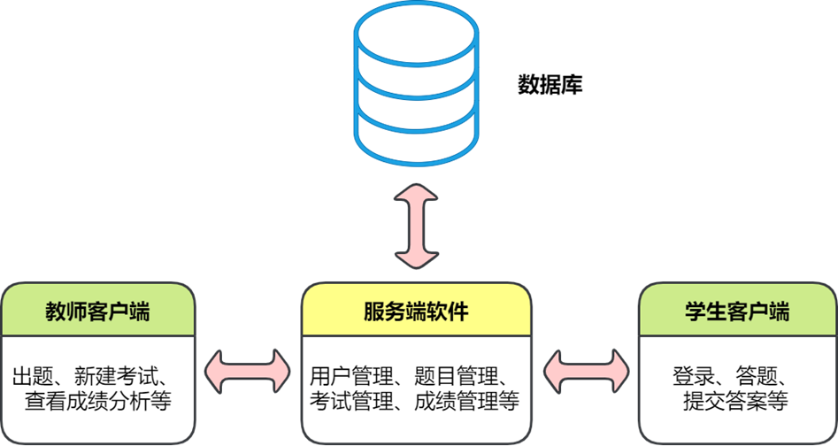

建议开发者在阅读设计文档前先阅读两个用户手册，
在用户手册中提到的概念在此不会重新解释。

系统为教师和学生两种用户分别设计了客户端，
而它们的核心功能主要由一个服务器支持，
服务器在后台还会连接一个数据库。



系统的技术选型如下：

---
服务器：

- [Gin](https://gin-gonic.com/)，Go 语言高性能服务器框架
- [Viper](https://github.com/spf13/viper)，Go 语言配置（configuration）管理库
- [Gorm](https://gorm.io/index.html)，Go 语言的 ORM 库
- [MySQL](https://www.mysql.com/)，开源的数据库管理软件

客户端：

- [PyQt5](https://pypi.org/project/PyQt5/)，Python 语言的 Qt5 绑定
- [Vue](https://v2.vuejs.org/)，一套用于构建用户界面的渐进式框架
- [ElementUI](https://element.eleme.cn/#/)，简单好用的 Vue 组件库
---

教师客户端是用 Vue 构建的前端应用，可在浏览器上使用。
而学生客户端为了满足特定需要（主要是反作弊），是使用 PyQt5 创建的桌面应用，但页面本身为了方便开发仍用 Vue 构建。

上面的技术选型只涵盖了主要的依赖，全部依赖请参见各自源码中的依赖文件，
在本设计文档的对应章节中也会提到其中的一些。

系统源码由 git 作版本管理，仓库主要在 [GitHub](https://github.com/gonearewe/EasyTesting) 托管。master 分支放源码，gh-pages 分支放文档。
master 分支文件结构如下：

```
.
├── LICENSE
├── README.md
├── build               用于构建的脚本
│   ├── build_student.bat
│   └── build_teacher_and_server.bat
├── img                 供 README.md 使用的图片
│   ├── jb_beam.svg
│   ├── logo.png
│   ├── ...
│   └── teacher_client_demo_5.png
├── server              服务端源码
│   ├── init.go
│   ├── main.go
│   ├── go.mod
│   ├── ...
│   ├── dao
│   │   ├── bfq.go
│   │   ├── ...
│   │   └── tfq.go
│   ├── handlers
│   │   ├── bfq.go
│   │   ├── ...
│   │   └── tfq.go
│   └── utils
│       ├── cache.go
│       ├── password.go
│       └── utils.go
├── student_client      学生客户端源码
│   ├── pyqt            PyQt 部分
│   │   ├── Pipfile
│   │   ├── ...
│   │   ├── local_server.py
│   │   ├── main.py
│   │   └── main.spec
│   └── vue             Vue 部分
│       ├── src
│       │   ├── App.vue
│       │   ├── main.js
│       │   ├── permission.js
│       │   ├── ...
│       │   ├── api
│       │   │   └── index.js
│       │   ├── utils
│       │   │   ├── cookie.js
│       │   │   ├── ...
│       │   │   └── validate.js
│       │   └── views
│       │       ├── 404.vue
│       │       ├── home
│       │       │   └── index.vue
│       │       └── login
│       │           └── index.vue
│       ├── ...
│       ├── package.json
│       └── vue.config.js
├── teacher_client      教师客户端源码
│   ├── ...
│   ├── src
│   │   ├── main.js
│   │   ├── permission.js
│   │   ├── App.vue
│   │   ├── ...
│   │   ├── api
│   │   │   ├── exam.js
│   │   │   ├── ...
│   │   │   └── user.js
│   │   └── views
│   │       ├── 404.vue
│   │       ├── exam
│   │       │   ├── chart.vue
│   │       │   ├── ...
│   │       │   └── resize.js
│   │       ├── login
│   │       │   └── index.vue
│   │       ├── ...
│   │       └── teacher
│   │           └── index.vue
│   └── vue.config.js
└── test                用于测试的脚本
    ├── Pipfile
    ├── Pipfile.lock
    ├── student.py
    └── teacher.py

72 directories, 260 files
```


