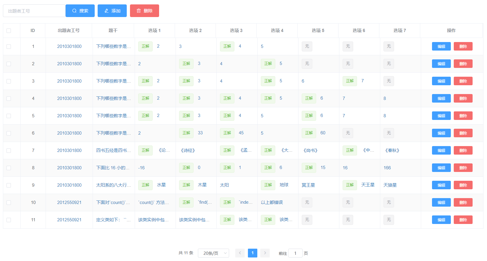
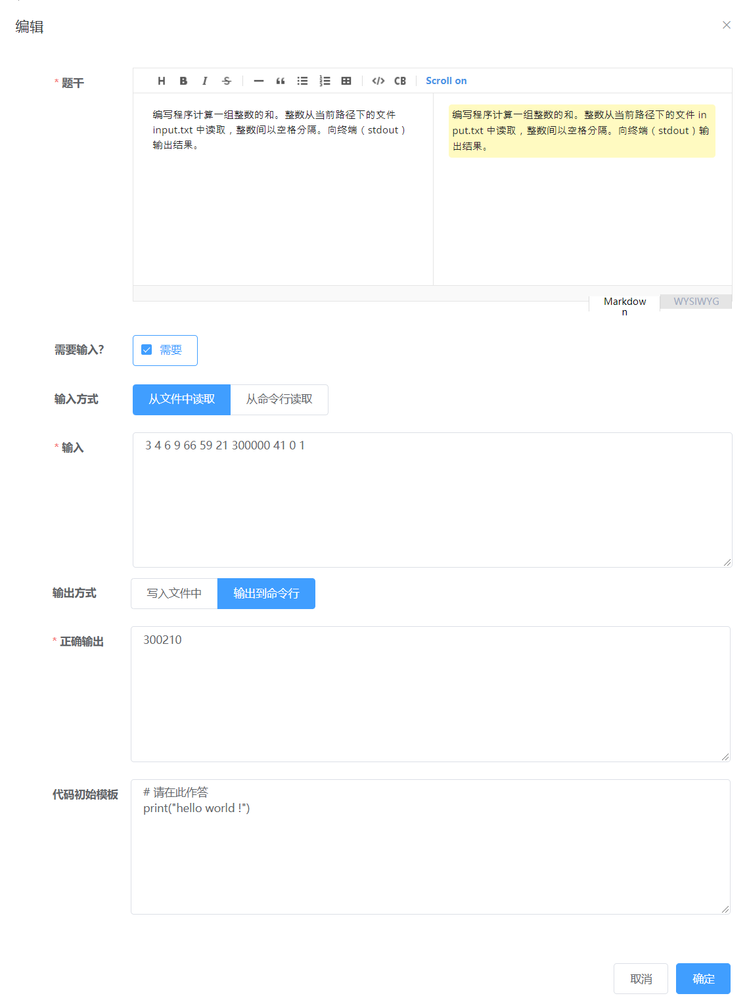

*试题管理*模块包括五个页面（对应于五种题型）：
*单选题*、*多选题*、*填空题*、*判断题*、*代码阅读题*和*编程题*。
这些页面也都是基于表格的，大同小异，
文档主要介绍*多选题*页面和*编程题*页面，其他可依此类推。

## 多选题



所有题目都只支持按*出题者工号*进行搜索，且同样只支持前缀检索。
点击*添加*按钮就会弹出对应的对话框。


可以看到所有题目都需要一个*题干*，
选好*选项数*后对话框还会要求填写对应数量的选项内容以及正确答案。
*题干*和各个选项的内容都支持 Markdown。
Markdown 是一种简单的富文本格式，可以在[这里](https://www.markdownguide.org/basic-syntax/)学习其语法。
对话框内置了一个简易的 Markdown 编辑器。
上面有常用的语法按钮，右下角可切换是否显示右侧的预览区，
预览区的效果基本与学生在考试时看到的效果一致。

> #### info::事先保存好 Markdown
>
> 意外退出对话框或对话框提交失败后，里面的内容都会丢失。
> 并且由于界面大小受限，对话框字体较小，不适宜在此长期编写题目。
> 所以建议事先使用其他 Markdown 编辑器
> （例如 [Typora](https://typora.io/)）编写题目并保存，
> 再将题干等粘贴到对话框中，仅用内置编辑器做些小修改。

表格显示了多选题的基本信息，包括*出题者工号*、*题干*和各个选项的内容。
注意到*题干*等因为字符过多，无法完全显示，
鼠标指针悬浮在其上可以查看更多的文本，
如果要查看完整的文本，只能进入*编辑*对话框。
多选题的选项数量是各有不同的，对于*选项数*不足七的题目，
多余的选项在表格中以一个写着“无”的灰色*标签（Tag）*占位。
多选题有多个正确选项，正确选项左侧会出现一个写着“正解”的绿色标签。
如果是单选题，每道题只会有一个“正解”标签。

## 编程题

编程题的*编辑*对话框如下所示。



如果不勾选*需要输入*，考试时本题的判题程序就会跳过输入阶段。
否则，用户必须填写*输入方式*和*输入*的内容，
考试时本题的判题程序会根据此题的配置将给定内容以给定方式提供给考生编写的程序。*输出方式*项和*正确输出*项同理，
只有当考生编写的程序的输出与*正确输出*相同，该考生才能得分。

> #### warning::事先测试编程题
>
> 编程题较为复杂，为了避免设置不当导致的问题，最好进行事先测试。
> 创建一个考试，调大编程题数目以确保能随机到要测试的题目，
> 然后用自己编造的考生登录学生客户端作答，最后检查成绩是否符合预期。

*代码初始模板*项的内容会作为学生客户端该题的编辑器初始内容。
可以通过它向考生提供关于本题的提示（用注释），或给予一部分代码框架。

在表格中，对于*输入*一列，如果*输入方式*为*从文件中读取*，
则*输入*内容左侧会出现写有*文件*的标签；若为*从命令行读取*，
则出现写有*命令行*的标签；假如没有输入，出现写有*无*的标签。
对于*正确输出*一列同理，只不过*正确输出*是一定会有的，不会出现*无*。

## 填空题与代码阅读题

> #### danger::填空的答案要求顺序完全一致
> 
> 填空题与代码阅读题会给考生一到多个空来填写，
> 判题程序比对答案时要求答案顺序严格一致，否则不得分。
> 用户出题时要注意避免答案顺序任意的情况。

下面这道题出的不好：

```
问题：面向对象的三个基本特征是__、__和__。
答案：封装、继承、多态
```

假如考生答：

```
继承、封装、多态
```

则只有最后一个空能得分。
用户应当避免这样的题目，或引入其他约束固定答案顺序。