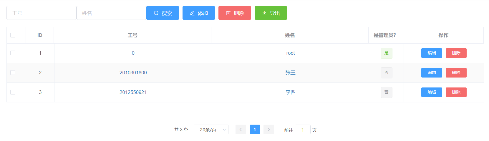

*教师管理*页面是仅有管理员可访问的页面，
普通教师无法在*导航菜单*上看到这一页面。
管理员可在此维护所有教师（包括自己和其他管理员）的信息。

同样是做用户管理，可以发现*教师管理*页面与先前介绍的*学生管理*页面
十分相似，重复的部分将不再介绍。

操作栏的搜索组件包含两个搜索框，全都支持部分检索，但工号只支持前缀检索。
*添加*对话框与*学生管理*的类似，但有一个特别的*管理员权限*标签，
若勾选它，创建的便是又一个管理员，否则创建的是普通教师。
教师名单可通过*导出*功能生成，但考虑到实际应用情景，
*教师管理*不支持*导入*功能。

管理员可以删除其他任何教师，但不能删除自己。

> #### danger::谨慎删除
>
> 删除教师的后果比删除学生更加严重，它会导致该教师创建的试题、
> 考试都被随之删除。最好不要删除任何一个曾在系统中有积极活动的教师。

*编辑*教师时如果在表单的*密码*项留空，则不会修改该教师的密码，
如果填入了字符，则其会成为该教师的新密码。

> #### warning::此页面的小问题
>
> 受限于前端的权限管理技术，本页面不支持*刷新*、从地址栏访问等操作，
> 否则会显示 404 错误，此时从地址栏访问首页即可解决。
>
> 如果需要刷新表格，直接清空所有搜索框并点击*搜索*即可。

