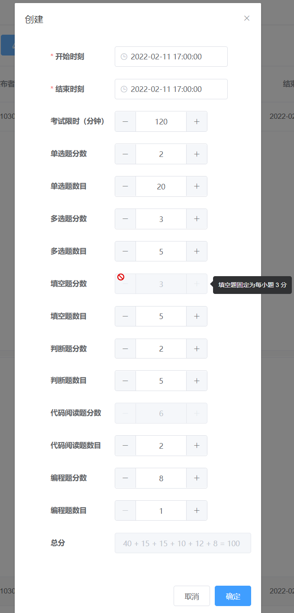

*考试管理*模块允许用户创建、查看、修改、删除线上考试，
还允许在一个单独的页面查看成绩分析。

## 对考试的管理

一场考试包含以下信息：考试的*开始时刻*与*结束时刻*、
考生的*考试限时*以及各种题型的总小题数、每小题分数。
在*创建*与*编辑*对话框中，*开始时刻*与*结束时刻*都支持直接的文本编辑，
但更推荐通过时间选择器（点击输入框后弹出）设置；
**其他的输入项都必须为正整数**，既可以通过数字输入框左右的加号、减号调节，
又支持直接的文本编辑；个别输入项使用固定值，无法改变；
对话框最后一项为*总分*，它是根据上面的各种题型的题数与分数自动计算的，
只有*总分*为 100 分时，对话框才能被提交。

> #### info::理解“考试限时”的意义
>
> *考试限时*不等于*结束时刻*减*开始时刻*，而是应当小于它。
>
> 因为学生参加考试的时间是弹性的，他可以选择在*开始时刻*与*结束时刻*间的任意时刻登录。
> 每个学生的答题时间都是从各自的登录作答时刻开始计算的。但是*结束时刻*之后服务器将不再接受答卷的提交。
> 教师应当引导学生在考试开始后尽快登录作答。

任一考试必处于三个状态之一中：*已结束*意味着当前时刻在该考试*结束时刻*之后，*进行中*意味着现在处于*开始时刻*与*结束时刻*间，
*未开始*则意味着*开始时刻*在当前时刻后。
表格中用三种不同颜色的标签分别标识这三种状态。
注意*进行中*的考试不允许编辑和删除，而*已结束*的考试只能删除、不能编辑。
一般来说，新创建的考试必处于*未开始*状态，
随着时间流逝，考试自动变为*进行中*，此时考生才可以登录作答。
为了保证试题的一致性，当有考试在*进行中*时，*试题管理*模块将被禁用。

由于考试的信息较多，表格一开始只展示一部分。
通过点击某一个考试的*详情*列的下拉箭头，可以打开折叠的组件，
查看更多信息。如果该考试正在*进行中*，组件最下方会出现*查看考生名单*字样，
点击即会弹出*考生名单*对话框；如果该考试*已结束*，
组件最下方则会出现写有*查看考生作答情况*的按钮，点击就会进入*考试结果*页面。

## 查看考试结果

对结果的分析是以考试为基本单位的，不支持任何其他筛选条件。
在图示模式下，柱状图会展示选中的考试中考生成绩的区间分布，
不同的考试使用不同的颜色标识，各颜色代表的考试 ID 可在图例中查看；
在表格模式下，选中的考试中具体的考生成绩得以呈现，
最终*得分*显示在表格最后一列，分数区间以颜色区分。

| 分数区间 | 表格中的颜色 |
| :------: | :----------: |
|  [0,60)  |     红色     |
| [60,80)  |     橙色     |
| [80,90)  |     灰色     |
| [90,100] |     绿色     |

)

这里同样有十分实用的*导出*功能，
允许导出当前所选中的考试的所有成绩信息到一个 Excel 文件（xlsx 格式）中去。
