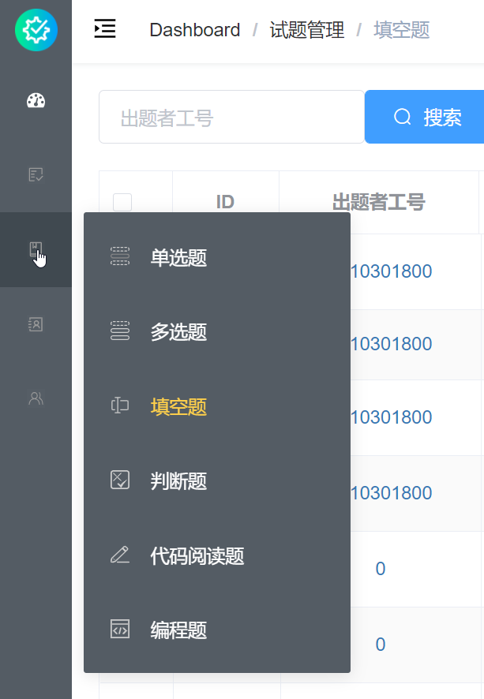
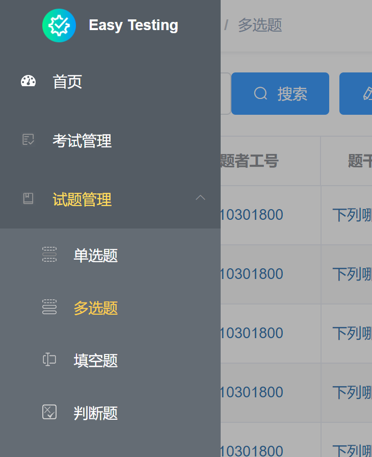

教师客户端界面如下图所示。

左侧是***导航菜单（NavMenu）***，导航菜单上方是系统 LOGO 与名称，
下方是树形结构的页面导航，在其上用鼠标左键点击即可跳转到对应页面。
无论跳转到哪一个页面，导航菜单都会固定在屏幕侧边；滚动长页面时，菜单也不会随滚轮运动。
通过点击导航菜单右上角的按钮，可以在菜单的两种显示模式间来回切换。
更瘦的显示模式隐去了页面导航的名称，鼠标悬浮在对应图标上时即会展示子菜单或页面名称。
 

使用*Ctrl+鼠标滚轮*可以缩放页面，当缩放比例过大时，导航菜单会消失；
此时点击导航切换按钮，菜单会重新出现，同时右侧界面上出现黑色透明的***遮罩层（Modal）***，
点击遮罩层即会退出菜单。

导航切换按钮同一行右边依次是***面包屑（Breadcrumb）***与带下拉箭头的动态***头像（Avatar）***。
它们都会出现在各个页面上方，但是滚动长页面时，它们并不固定。
面包屑会显示当前页面的所在路径，这对于深度嵌套的页面很好用，
不过本客户端仅有*试题管理*模块包含一级子菜单，所以作用不大。
单击头像即可打开一个小下拉菜单，由上到下依次是：

- 首页：跳转至首页
- 个人信息：打开*编辑个人信息*对话框
- 文档：跳转至在线文档
- 关于：提供关于本软件的基本信息
- 退出登录：注销当前账号的登录状态，并跳转至登录界面

*编辑个人信息*对话框包含三个输入项：工号、姓名、密码。
工号与姓名项默认显示当前账号的对应信息，密码项则不显示。
如果你要修改工号或姓名，作出所需的修改，并点击对话框右下的*修改*按钮。
**当且仅当你要修改密码时才填写新密码，否则留空即可。**

如果中途点击对话框右上角的关闭符号或右下角*取消*按钮，修改则不会被保存。
点击背景的遮罩层不会有任何作用（不会退出对话框）。
点击*修改*按钮后无论修改成功与否都会在界面的上半部分弹出对应的消息（Message）。
消息居中布局，悬浮显示，经过几秒就会自动消失，也可通过点击右侧关闭符号手动关闭。
消息的背景色随消息类型而变（错误消息为红色、成功消息为绿色等）。

> #### info::对话框（Dialog）与消息（Message）
>
> 对话框与消息的上述特性对本客户端的其他页面同样适用。