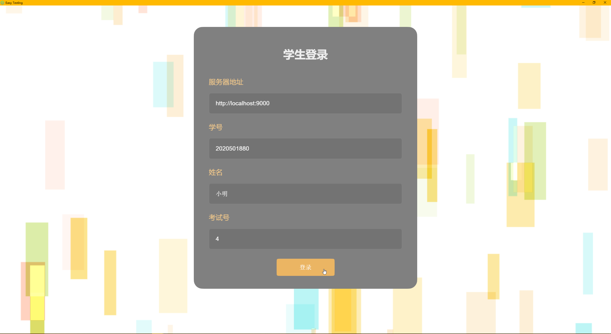
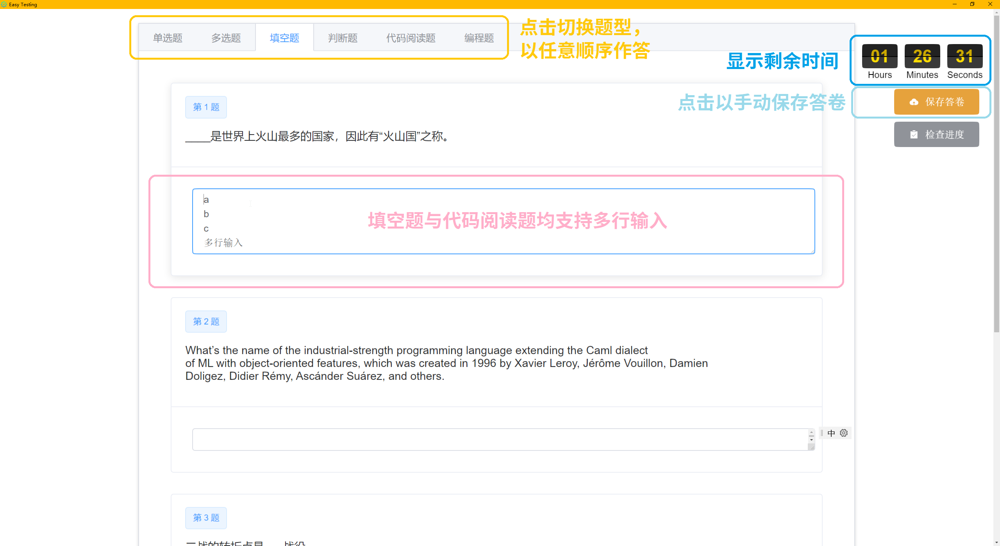
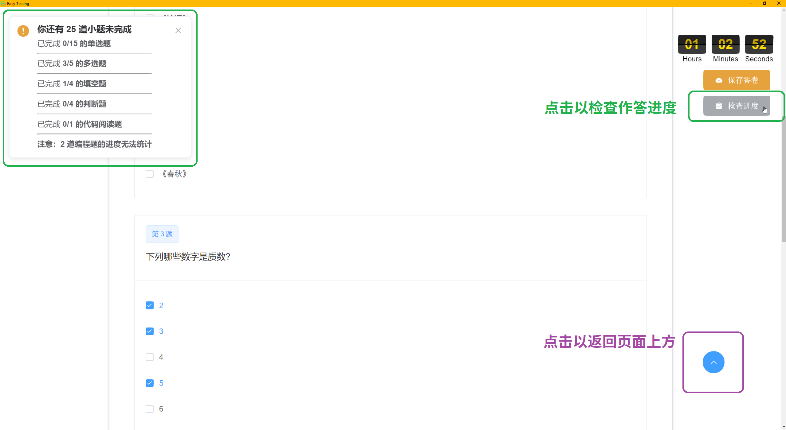
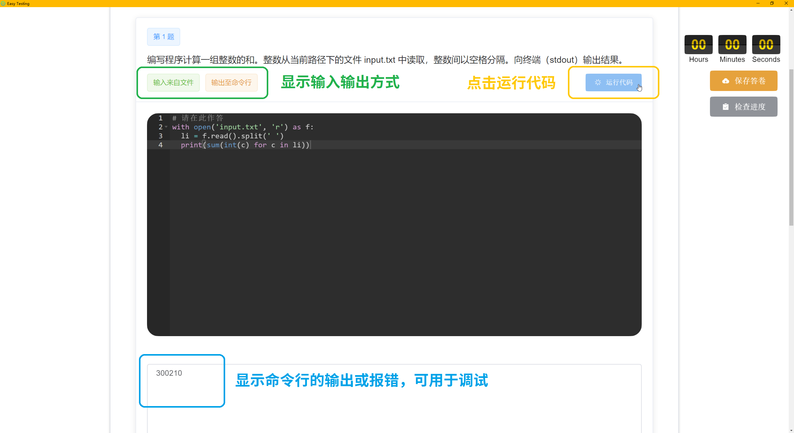

这是 Easy Testing 学生客户端的使用手册。
学生客户端可供学生连接服务端参加考试，拥有进度提示、自动保存、在线调试等功能。

软件无需安装，解压缩即可直接使用。

> #### warning::不要解压到含中文、空格等特殊字符的路径
>
> 软件无法在含特殊字符的路径中启动，尽量确保软件路径中仅含英文字母与数字。

启动程序为软件根目录下的 main.exe。

> #### warning::启动前先关闭杀毒软件等无用的软件
>
> 实测下，软件不会被 Windows Defender 拦截。
> 但保险起见，建议先关闭 360、各种“安全管家”软件；
> 如果有文件被杀软误删，可以重新解压软件目录覆盖。
> 为避免软件端口的冲突，其他无用的软件（如浏览器、下载器、聊天软件等）
> 也推荐关闭。

即使考试未开始，学生也可访问登录界面，所以**建议学生事先测试好软件能否正常打开，以免耽误正式考试**。
登录界面有一个包含四项输入的对话框。其中的*服务器地址*与*考试号*应由组织考试的老师告知，
学生则需正确填写自己的*学号*与*姓名*。在考试开始后，点击*登录*按钮，阅读并确认弹出的*注意事项*即可开始考试。

注意考试时间是弹性的。考试的*结束时刻*减*开始时刻*会大于*考试限时*，学生可以选择在*开始时刻*与*结束时刻*间的任意时刻进入考试，
他的答题时间将从自己的进入时刻开始计算的。例如，考试在 14:00~17:00 进行，*考试限时*为 2 小时，
那么 14:05 进入考试的学生在 16:05 就会交卷，而因故（迟到、电脑故障、网络不好等）在 15:00 才进入考试的学生则可答题到 17:00。
当然，要是晚到 16:30 才进入考试，17:00 考试一结束，照样不能继续答题。
总之，学生在开考后不必着急，可耐心准备，沉着应试。

考试主界面如下图所示。考试分为 5 种题型：单选题、多选题、填空题、判断题、代码阅读题与编程题。
其中，多选题全选对得满分，漏选得一半分，错选不得分；代码阅读题要求根据题意，阅读代码填空；编程题稍后详细介绍。
点击对应的标签即可跳转至该题型作答，**考试中的所有题目均可以任意顺序作答**。
软件会每隔两分钟左右自动保存一次学生的答卷，保存成功时会弹出提示。学生亦可通过点击右侧的*保存答卷*按钮手动保存。

软件另外提供了*检查进度*的按钮，点击就会弹出统计作答进度的消息框。它会提示总小题数与已作答的小题数，以避免学生漏答。
注意，编程题因为有初始模板的存在，不纳入统计。

编程题要求根据题意编写代码。编写的程序可能没有输入，但如果有的话，可能为命令行、文件两种输入方式之一。
命令行输入可以通过 `input()` 函数读取；而输入文件则为程序工作目录下的 input.txt，
可以通过 `open('input.txt', 'r')` 读取，当然，实际使用时可能会用 `with` 关键词作资源管理等。
类似的，程序必有输出，也可能为命令行、文件两种输出之一。命令行输出即为 `print()` 函数；
而输出文件为程序工作目录下的 output.txt，可以通过对应方法写入文本。**应当注意不要输出多余的空格与回车。**
输入输出方式会在题干下方标明。编程的任何时候都可*运行代码*查看命令行的输出，它将显示在下方的文本框中，
语法错误、程序异常、超时错误等也会在那显示。
学生可以通过 `print()` 函数打印中间变量以调试程序，但是最终提交的代码中不应当有用于调试的逻辑。

> #### warning::务必在*保存答卷*前*运行代码*
>
> 尤其注意，软件只会保存最近一次*运行代码*时的结果。
> 所以，学生在完成或修改代码后务必要运行一次。

软件并不支持提前交卷。如果确定不再作答了，直接*保存答卷*，待收到成功提示后关闭软件即可。