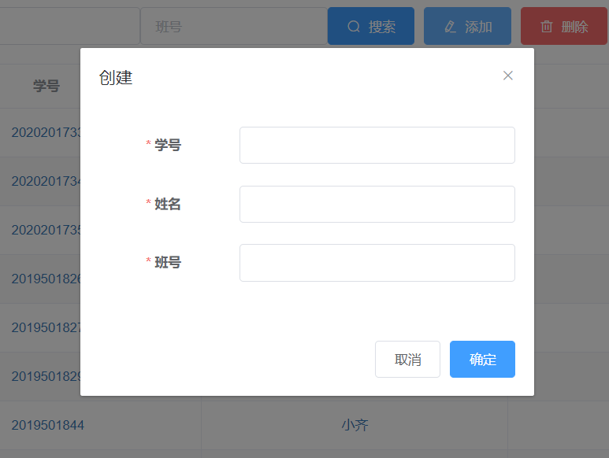

首先介绍学生管理页面。

**页面由上到下分别为操作栏、表格（Table）与分页器（Pagination）。**

## 操作栏
### 搜索功能

操作栏的左半部分是搜索组件。学生管理页面的搜索组件带有三个搜索框，
可分别检索学号、姓名与班号。**它们全都支持部分检索，
但是学号和班号只支持前缀检索。**
填写检索条件后回车或点击*搜索*按钮即可开始检索。
只填写一个搜索框，而其他留空便是单个检索；
也可填写多个，实施联合检索，**多个检索条件间是布尔与的关系**。
清空所有搜索框再进行检索，便会显示所有数据，这也是刚进入页面时的初始状态。

假如有如下示例数据：

|    学号    | 姓名  |   班号   |
| :--------: | :---: | :------: |
| 2019501848 | 小明  | 06330058 |
| 2019501849 | 小红  | 06330059 |
| 2018201826 | 阿明  | 05370014 |

则会有这样的检索情境：

- 学号检索*2019*得到*小明*和*小红*
- 学号检索*2019*，同时班号检索*06330058*得到*小明*
- 姓名检索*明*得到*小明*和*阿明*
- 学号检索*018201826*没有一条记录，虽然*阿明*学号包含它，但它不是前缀

执行检索后表格显示加载动画，稍后便会更新数据。
如果网速较快，加载动画可能会一闪而过。
如果网络异常或服务器故障，则会弹出错误消息，表格也不会更新。

### 添加功能

操作栏的右半部分有*添加*、*删除*、*导入*、*导出*四个按钮。

点击添加按钮会进入*添加*功能对话框。

这里的对话框也十分简单。仅需提供必要的三项信息便可创建一个学生。
创建成功后表格也会自动更新，将会显示新创建的学生。
如果新创建的学生的学号已存在于系统中，创建会失败。
注意，学号与班号并非仅包含数字，任何字符都是可以的。

> #### warning::提供正确的信息
>
> 只有记录进学生管理模块的考生才能参加考试，
> 考生登录考试时需要提供与此处一致的学号与姓名。

### 删除

删除功能用于批量删除**表格本页**的**一到多行**记录。

表格每行最左端都有一个单选框，
点击它即可在*选中本行*与*取消选中本行*间进行切换。
如本页文档最上方的图片所示，多行记录可被同时选中。
点击表头最左端的单选框还可在*选中全部*与*取消选中全部*间进行切换。

点击*删除*按钮即会删除当前选中的所有行记录。
不过，在此之前，会弹出一个要求确认的对话框，
它会提示将要被删除的学生信息以供核对，此时*取消*或关闭对话框即可反悔。
成功删除后表格也会随之更新。

> #### warning::谨慎删除
>
> 被删除的学生无法参加后续考试，其以前的作答记录也会被随之删除。
> 并且删除操作基本无法撤销，记录会永久丢失。

### 导出

导出功能可将**满足当前检索条件**的**所有**学生记录写入一个 Excel 文件（xlsx 格式）。
只需点击按钮，浏览器很快就会弹出文件的下载请求。
打开文件即可在第一个 `Sheet` 找到全部的数据。

## 表格

表格都有一个表头，描述各个列的数据类型。

ID 列显示各条记录的全局唯一的 id，它会随之新记录的创建不断递增。

最右侧的一列是操作列，不同于页面最上方的操作栏，这里的操作是针对某一行的。
点击某一行的编辑按钮即可进入编辑对话框。

它与*添加*对话框十分相似，不过这里的表单默认不是空的，
而是填着要编辑的那行记录的对应信息。
可以在此作出一些改动，并点击*确定*保存修改。

点击某一行的*删除*按钮即可单独删除该行记录。
这里同样会先出现一个悬浮在删除按钮下方的*弹出对话框（popover）*要求确认。

剩下的列便显示记录的各项信息。

> #### warning::快速开始编辑
>
> 你也许注意到了，这些信息的字体是蓝色的，且鼠标指针悬浮在上面时会变形，
> 其实它们都是可点击的，点击它们等效于点击所在行的*编辑*按钮。

## 分页器

学生的记录数通常很大，不可能在一页表格中得以全部显示，
所以表格默认都是分页展示的。
第一次打开页面或完成检索后，表格显示的都是第一页。
分页器会显示总记录数、当前所在页数，并允许用户改变每页记录数和
跳转到指定页数。